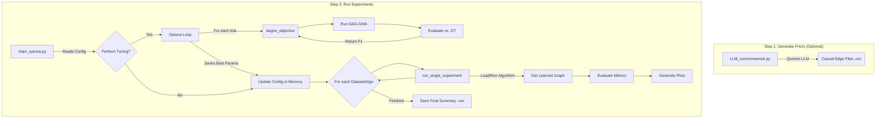

# Injecting-LLM-Commonsense-into-Causal-DAG-Discovery

An extensible Python framework for comparing causal discovery algorithms, with and without priors generated by Large
Language Models.

---

## Key Features

| Capability                    | Description                                                                                                                                |
|-------------------------------|--------------------------------------------------------------------------------------------------------------------------------------------|
| **Multiple Algorithms**       | Plug-and-play implementations of PC, GES, and DAG-GNN for comprehensive comparison.                                                        |
| **LLM Prior Integration**     | Leverages Gemini and Claude to generate causal priors and initialize the `adj_A` matrix in DAG-GNN, guiding the learning process.          |
| **Hyperparameter Tuning**     | Built-in Optuna integration for rigorously tuning DAG-GNN hyperparameters to maximize performance (F1-score) for each dataset and variant. |
| **Rich Evaluation Suite**     | Calculates SHD, Precision, Recall, and F1-score for both the graph skeleton and strictly directed edges, saving results to a summary CSV.  |
| **Comparative Visualization** | Generates detailed NetworkX plots comparing learned graphs to ground truth, highlighting correct, missing, and extra edges.                |

---

## Repository Layout

```
├── algorithms/                 
│   ├── pc_algorithm.py
│   ├── ges_algorithm.py
│   └── dag_gnn_algorithm.py
│   └── dag_gnn/
├── datasets/
│   ├── gemini/
│   ├── claude/
│   ├── asia_N2000.csv
│   ├── asia_N5000.csv
│   └── sachs_observational_continuous.csv
├── llm_utils/
│   ├── data_processing.py 
│   └── llm_query.py
├── utils/
│   ├── data_processing.py
│   └── evaluation.py
├── visualization/
│   ├── graph_visualization.py
│   └── plotting_utils.py
├── LLM_commonsense.py
├── main_optuna.py
└── visualizations_output_project/
```

---

## Code Architecture & Flow

### 1. Execution Pipeline



### 2. Key Modules

| Module                | Purpose                                                                                                            |
|-----------------------|--------------------------------------------------------------------------------------------------------------------|
| `main_optuna.py`      | Core orchestrator that runs Optuna tuning and/or final experiments based on the main `DATASETS_CONFIG` dictionary. |
| `LLM_commonsense.py`  | Script to query an LLM for causal links and save the resulting priors to CSV files.                                |
| `algorithms/`         | Wrappers for causallearn’s PC and GES, and a full DAG-GNN implementation with provided adjacency matrix from LLM.  |
| `llm_utils/`          | Handles LLM API interaction and parsing.                                                                           |
| `utils/evaluation.py` | Calculates SHD, F1, Precision, Recall metrics.                                                                     |
| `visualization/`      | Generates visualizations using NetworkX and Matplotlib.                                                            |

---

## Extending the Framework

- **Add a new dataset:** Drop a CSV into `datasets/` and update `DATASETS_CONFIG` in `main_optuna.py`.
- **Add a new algorithm:** Subclass `BaseAlgorithm` in `algorithms/` and register it in `AlgorithmFactory`.
- **Use a different LLM:** Extend `llm_utils/llm_query.py` with your API logic and register your `llm_type`.

---

## Installation

```bash
# 1. Clone repository
$ git clone <your_repository_url>
$ cd <your_repository_name>

# 2. (Recommended) create virtual environment
$ python -m venv venv && source venv/bin/activate

# 3. Install dependencies
$ pip install -r requirements.txt
```

---

## Quick Start

1. **Set API Keys**  
   Create a `.env` file in the root directory:
   ```
   GENAI_API_KEY="your_google_gemini_api_key"
   ANTHROPIC_API_KEY="your_anthropic_claude_api_key"
   ```

2. **Generate LLM Priors (Optional):**

```bash
$ python LLM_commonsense.py
```

3. **Configure Main Runner:**  
   Edit `main_optuna.py`:

- Set `PERFORM_OPTUNA_TUNING = True` or `False`
- Choose datasets and variants
- Verify paths in `DATASETS_CONFIG`

4. **Run Experiments:**

```bash
$ python main_optuna.py
```

5. **Inspect Results:**
    - Optuna outputs in `optuna_study_results/`
    - Plots in `visualizations_output_project/`
    - Summary CSV: `visualizations_output_project/experiment_results_summary_final.csv`

---

## Configuration Highlights

Example from `main_optuna.py`:

```python
DATASETS_CONFIG = [
    {
        "name_id": "sachs_continuous",
        "data_path": "datasets/sachs_observational_continuous.csv",
        "gt_path": "datasets/sachs_ground_truth_edges_17.txt",
        "data_type": "continuous",
        "algo_params_override": {
            "ges": {"penalty_discount": 2.0},
            "pc": {"alpha": 0.05},
            "dag-gnn-claude": {
                **DAG_GNN_BASE_PARAMS,
                "tau_A": 0.01,
                "z_dims": 5,
                "llm_prior_edges_path": "datasets/claude/sachs_observational_continuous_causal_edges.csv"
            }
        }
    }
]
```

---

## Reproducing Experiments

To replicate results:

- Set `PERFORM_OPTUNA_TUNING = True` and specify datasets/variants.
- After tuning, set it to `False`.
- Make sure `final_algorithms_to_run` includes everything.
- Run:

```bash
$ python main_optuna.py
```

---

## Interpreting the Outputs

- `visualizations_output_project/`: Subfolders with learned/true/comparison graphs.
- `experiment_results_summary_final.csv`: Summary table with SHD, F1, Precision, Recall.

Example:

| name                            | execution_time_sec | shd_custom_cpdag_vs_dag | f1_skeleton | f1_strict_directed |
|---------------------------------|--------------------|-------------------------|-------------|--------------------|
| sachs_continuous_ges            | 0.5231             | 15                      | 0.6250      | 0.4444             |
| sachs_continuous_dag-gnn-claude | 120.4510           | 11                      | 0.7826      | 0.6667             |

---

## License

Distributed under the MIT License. See `LICENSE` for more information.

